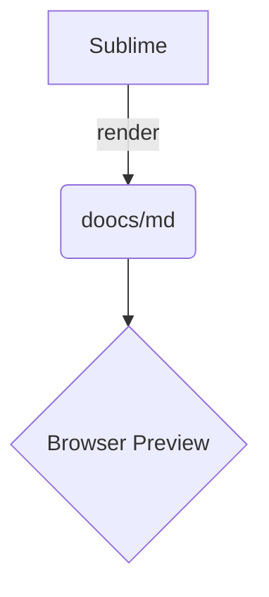

# 一级标题

支持 **加粗**、_斜体_、`行内代码`、[链接](https://github.com/doocs/md) 与行内公式 $E = mc^2$。

## 二级标题

> 引用块：表格与引用背景依赖 `--foreground` / `--blockquote-background` 变量。

### 三级标题

| 表头 A | 表头 B |
| ------ | ------ |
| 单元格 | 单元格 |

#### 四级标题

```ts
// macOS 风格代码块（默认开启）
export function greet(name: string): string {
  return `Hello, ${name}!`
}
```

##### 五级标题


###### 六级标题



- 列表项一
- 列表项二

1. 有序项
2. 有序项

---

这里有一个脚注引用[^1]。

[^1]: 脚注内容。
